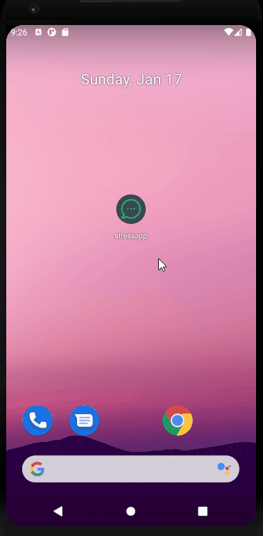

<h1 align="center">
  <br>
  
  <br>
  Stress App
  <br>
</h1>

<h4 align="center">An application made by <a href="https://flutter.dev/" target="_blank">Flutter</a></h4>


<p align="center">
  <a href="#what-is-it">What it is</a> •
  <a href="#getting-started">Getting Started</a> •
  <a href="#preview">Preview</a> •
</p>

## What it is

Many times we do not know whether to write to a person for fear of disturbing them while they are doing something important, the idea behind the application is to create a room where the user logs in with their account and can see the other people who are in the database, There you can see if they are available or if they are busy to know if you can send them a message or if you should wait for this person to be free

This is an app that I developed in order to practice using flutter with firebase as a backend.

## Getting Started

Make sure you have an emulator or a USB-connected device with debugging mode enabled to run the application there.

#### 1. [Set up Flutter](https://flutter.io/setup/)

#### 2. Clone the repo

In the Command Prompt (CMD):

```sh
$ git clone https://github.com/matifrancois/Flutter_StressApp.git
$ cd Flutter_StressApp
```

#### 4. Run the app

```sh
$ flutter run
```


## Preview





